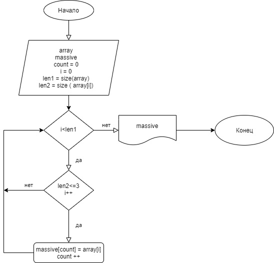

 # Описание алгоритма задачи к итоговой контрольной работе

 ## Задача: Написать программу, которая из имеющегося массива строк формирует массив из строк, длина которых меньше либо равна 3 символа. 

 ## Блок-схема алгоритма решения задачи

## Описание алгоритма работы кода

 1. Задаем 2 строковых массива. Длина первого массива произвольно выбрана равной 5,введены строковые значения  - элементы первого массива.
    Длина второго массива равна длине  первого массива,т.к., теоретически, все элементы первого массива могут "перекочевать" во второй, но не более.
 2. Первый метод - " Выборка". Имеет агументами 2 строковых массива. С помощью цикла for перебираем последовательно элементы первого массива, попутно проверяя длину каждого элемента. Если эта длина <= 3,тогда этот элемент первого массива становится элементом второго массива.
 3. Второй метод - " Печать массива". Имеет в качестве аргумента - строковый массив. С помощью цикла for перебираем последовательно элементы второго массива, выводим их в консоль.
 4. Последовательно вызываем оба метода. В качестве аргументов для метода " Выборка" принимаются первый и второй наш массивы.В качестве аргумента для метода " Печать массива" принимаются  второй массив.